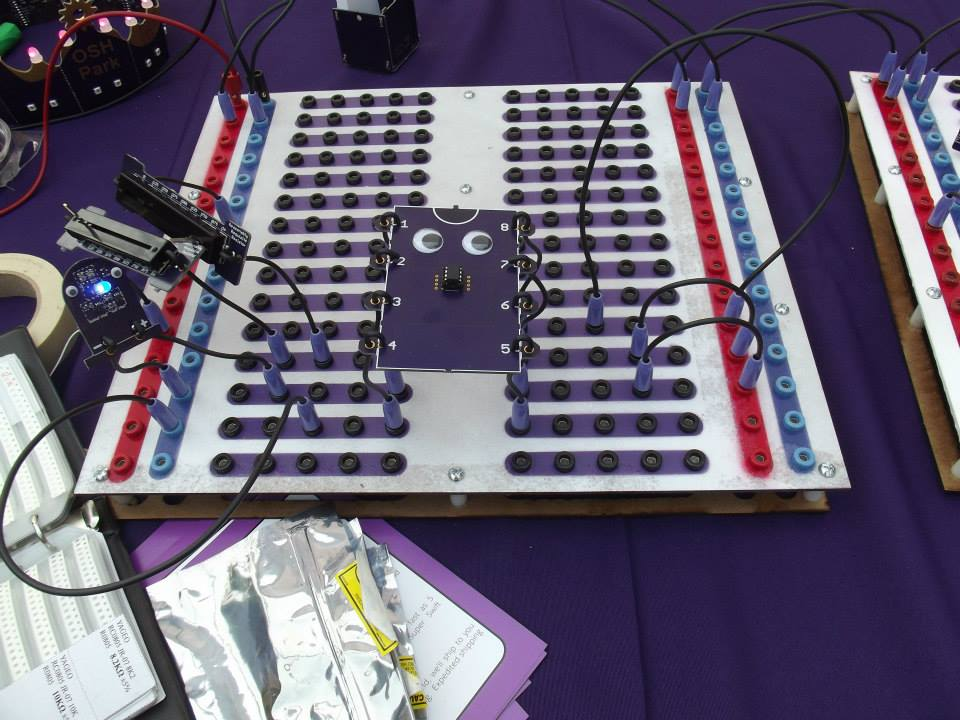

A Bigger Better Breadboard
===========================
A ridiculously large 10x scale breadboard, with complete breadboard functionality and some basic components.

But, why?
---------
Because it's neat! This was designed by [OSH Park](https://oshpark.com) for the PDX Mini Maker Faire 2014, as a way to help demonstrate
some simple basic breadboard skills and circuits. 

Among the common issues we've incounted during workshops, demos, and clases:
- It's not immediately apparent how a breadboard works, and can be tough to explain and double check
- Breadboards are really tiny, so it's hard to use for demonstration.
- Exposed wire leads will short out together, and can be a frusturating experience for newcomers.
- Small kids want to learn, but tend to wreck component leads, making it hard for them and others to work with. 
- Small kids and small parts can be bad. 
- Inexperienced users will eventually do something wrong and burn out your parts. But, failure creates learning opportunities that they won't get by avoiding them. We want to encourage those failures. 
- Small parts can be tough to just fiddle with, and lead to some overwhelming demos.

So, we tried to make something a bit more robust, visible, beginner friendly, and fun! This is the result.

Liscence
--------
This design is intended to be open hardware, and is liscenced under [Creative Commons Attribution, Share-Alike 3.0](http://creativecommons.org/licenses/by-sa/3.0/)
If this liscence prohibits you from enjoying this project, please let us know so we can consider adjusting the liscence. 
